<<<<<<< HEAD
# 🛡️ CivicShield — AI-Powered Public Infrastructure Monitoring System

**CivicShield** is an automated, end-to-end civic-tech platform that detects, classifies, analyzes severity, geolocates, deduplicates, prioritizes, and tracks public infrastructure defects using Computer Vision (YOLO + OpenCV), spatial-temporal perceptual hashing, dynamic priority scoring, and municipal dispatch workflows.

---

## 🏗️ System Architecture

```mermaid
flowchart LR
    A["1. Collect Images<br/>(Citizen App / Camera / EXIF)"] --> B["2. AI Detect<br/>(YOLOv8 / Vision AI)"]
    B --> C["3. Classify<br/>(Department Mapping)"]
    C --> D["4. Severity<br/>(LOW / MEDIUM / HIGH)"]
    D --> E["5. Location<br/>(EXIF / GPS / Geocoding)"]
    E --> F["6. Duplicate Check<br/>(pHash <= 12 & <= 30m)"]
    F --> G[("7. Database<br/>(SQLite / SQLAlchemy)")]
    G --> H["8. Priority<br/>(Score 0-100 & Band)"]
    H --> I["9. Dashboard<br/>(Leaflet GIS & Ranked Queue)"]
    I --> J["10. Assign Team<br/>(Maintenance Squad)"]
    J --> K["11. Status Tracking<br/>(Detected -> In Progress -> Resolved)"]
```



### 🔄 End-to-End Pipeline Workflow:

$$\text{Collect Images} \longrightarrow \text{AI Detect} \longrightarrow \text{Classify} \longrightarrow \text{Severity} \longrightarrow \text{Location} \longrightarrow \text{Duplicate Check} \longrightarrow \text{Database} \longrightarrow \text{Priority} \longrightarrow \text{Dashboard} \longrightarrow \text{Assign Team} \longrightarrow \text{Status Tracking}$$

1. **Collect Images**: Citizen photo upload via drag-and-drop or device camera.
2. **AI Detect**: Neural network detection (YOLOv8 / Vision AI fallback) generating bounding box coordinates and object confidence.
3. **Classify**: Automatic mapping to the responsible municipal department:
   - *Pothole / Road Crack / Damaged Road* $\rightarrow$ **Road Department**
   - *Broken Streetlight* $\rightarrow$ **Electrical Department**
   - *Drain Overflow / Waterlogging* $\rightarrow$ **Drainage/Sewerage Department**
   - *Garbage Accumulation* $\rightarrow$ **Sanitation Department**
4. **Severity**: Multi-factor evaluation (bounding box area ratio, road type, traffic density, location hazard, pedestrian risk) categorizing defect severity into `LOW`, `MEDIUM`, or `HIGH`.
5. **Location**: Auto-extraction of EXIF GPS coordinates with browser geolocation and manual map pin fallbacks, reverse-geocoding the human-readable area name.
6. **Duplicate Check**: Spatial-temporal perceptual hashing (`imagehash.phash`) matching defects of the same type within 30 meters and 7 days with Hamming distance $\le 12$. Merges duplicate reports without creating redundant tickets.
7. **Database**: Persistent storage in SQLite via SQLAlchemy tracking media paths, timestamps, report frequency, coordinates, and team assignments.
8. **Priority**: Multi-criteria weighted scoring algorithm:
   - Severity: `LOW=10`, `MEDIUM=22`, `HIGH=35`
   - Traffic: `low=5`, `medium=12`, `high=20`
   - Location Risk: `+20` if near school/hospital/highway POI, else `5`
   - Waiting Time: $\min(15, \text{days\_unresolved} \times 1.5)$
   - Duplicate Frequency: $\min(10, (\text{report\_count} - 1) \times 2.5)$
   - Bands: **Critical** (80–100), **High** (50–79), **Medium** (25–49), **Low** (0–24).
9. **Dashboard**: Municipal Operations Console built with React, Leaflet OpenStreetMap (colored markers sized by report count), summary metrics cards, and ranked triage queue.
10. **Assign Team**: Dispatch interface assigning specialized municipal maintenance squads (`PATCH /api/issues/{id}/assign`).
11. **Status Tracking**: Lifecycle state progression (`Detected` $\rightarrow$ `Assigned` $\rightarrow$ `In Progress` $\rightarrow$ `Resolved`).

---

## 💻 Tech Stack

| Component | Technology | Description |
|---|---|---|
| **Frontend** | React 18, Vite, Tailwind CSS | Dark navy & teal civic-tech UI |
| **Mapping** | Leaflet, React-Leaflet, OpenStreetMap | Interactive GIS map with color-coded priority markers |
| **Backend** | Python 3.10+, FastAPI, Uvicorn | High-performance asynchronous REST API |
| **AI / Vision** | YOLOv8 (Ultralytics), OpenCV, Pillow | Object detection and visual inference |
| **Deduplication** | ImageHash (pHash), Haversine Distance | Perceptual hashing and geospatial proximity matching |
| **Database** | SQLite, SQLAlchemy, Alembic/Migrations | Relational data persistence |

---

## 🚀 Setup & Installation Steps

### 1. Prerequisites
- **Python 3.10+**
- **Node.js 18+** and **npm**

---

### 2. Backend Setup

```bash
# Navigate to backend directory
cd backend

# Create and activate Python virtual environment
python -m venv .venv
# On Windows (PowerShell):
.venv\Scripts\Activate.ps1
# On Linux/macOS:
source .venv/bin/activate

# Install Python dependencies
pip install -r requirements.txt
pip install imagehash pillow

# Run database migrations and seed 40 realistic demo issues
python migrate_db.py
python seed.py

# Start FastAPI server
uvicorn main:app --reload --port 8000
```
*Backend runs on `http://localhost:8000` (API Docs at `http://localhost:8000/docs`).*

---

### 3. Frontend Setup

```bash
# Navigate to frontend directory
cd frontend

# Install dependencies
npm install

# Start Vite development server
npm run dev
```
*Frontend runs on `http://localhost:5173`.*

---

## ⚡ Instant Demo Mode (Offline Fallback)

On the **Citizen Report** page (`/`), click the **⚡ Demo Mode** button.
- Automatically generates a realistic synthetic defect photo.
- Injects fixed GPS coordinates (`MG Road Corridor, Indore: 22.7196° N, 75.8577° E`).
- If backend is offline or disconnected, it instantly switches to an offline simulated AI vision result with bounding box annotation, duplicate merge notice, and priority score.

---

## 🛣️ Roadmap & Future Work

1. 📹 **Municipal Vehicle Video & CCTV Ingestion**:
   - Ingest continuous dashcam and municipal vehicle video synchronized with GPS track files (`.csv` / `.json`).
   - Periodic frame sampling, speed-adjusted spatial interpolation, and automated road defect mapping along patrol routes.
2. 🔍 **AI-Powered Repair Verification**:
   - Post-maintenance photo capture uploaded by field crews.
   - Perceptual hash and before/after computer vision validation to verify physical defect resolution before marking tickets `Resolved`.
3. 📲 **Citizen Notification & SMS Alerts**:
   - Automated push notifications and SMS updates to citizens when their submitted report is triaged, assigned, and repaired.
4. 🤖 **Edge AI Fleet Deployment**:
   - Lightweight YOLO ONNX/TensorRT models running directly on municipal garbage trucks and sweepers for real-time edge defect telemetry.
=======
# CivicShield
AI-powered public infrastructure monitoring system that detects, classifies, and prioritizes civic issues such as potholes, damaged roads, broken streetlights, and overflowing drains.
>>>>>>> 9f123482719dfcf4dcd310c36375fc9b49c76c95
